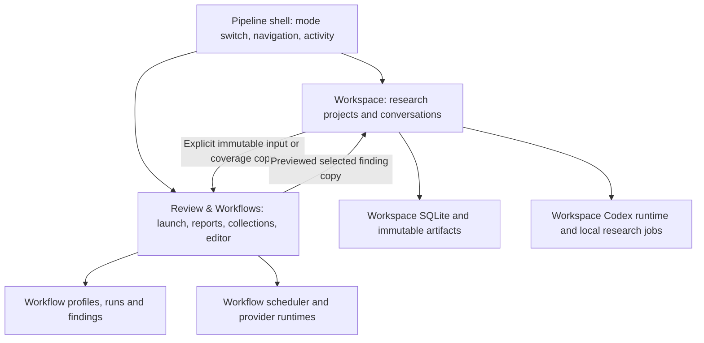

# Pipeline: new features for an academic research workspace

**Prepared:** September 7, 2026.  
**Status:** recommendations and implementation plan; no application changes are made by this document.  
**Baseline:** the working tree inspected on September 7, including the uncommitted Workspace, Research Studio, project exchange, and Workflow App Server work.  
**Audience:** product decisions first, followed by implementation in this repository.

**Navigation:** [Assessment](#2-what-i-inspected-and-what-the-application-showed) · [Feature priorities](#4-prioritized-feature-portfolio) · [Detailed designs](#5-feature-designs-and-implementation) · [Delivery sequence](#7-delivery-sequence) · [Acceptance scenarios](#8-acceptance-scenarios-and-measurement)

## 1. Recommendation

Make **Workspace** and **Review & Workflows** equal destinations in Pipeline. Give Workspace a persistent project desk where a researcher can read, compute, write, and consult an assistant around the same research objects. Keep Review & Workflows as an independently usable environment for deterministic analysis and review, with its own launch, history, settings, and recovery.

The strongest opportunity is the connection between a research question and its supporting work: which source supports a claim, which sample produced an estimate, which computation produced a table, which assumption a proposition requires, and which revision addresses a referee comment. Pipeline already has much of the storage and provenance needed. Its next feature cycle should make those relationships useful in daily work and fill the missing acquisition, data, execution, and publication steps.

My recommended first investment is a complete vertical slice:

> Open a project → find a paper, decision, or result → ask a question beside it → run one isolated comparison → generate a table or figure → stage a manuscript change → inspect the evidence behind the change.

Prioritize that slice over another collection of independent inspector tabs. A successful research suite should save the researcher from repeatedly reconstructing context and moving artifacts between tools.

### Product decisions

1. **Two peer modes.** Equal visibility, independent readiness, independent remembered location, independent runtime ownership. Neither requires using the other.
2. **Projects can start with a question.** A manuscript, dataset, folder, model, or review can be added later. A rootless project and an unfiled conversation remain useful.
3. **Research objects persist beyond chat.** Documents, datasets, results, assumptions, decisions, tasks, and deliverables have stable identities. Conversations reference them.
4. **Evidence is inspectable.** A claim can be proposed, accepted by a researcher, checked numerically, or supported by a source passage. These are different facts.
5. **Existing tools remain useful.** Work with TeX editors, Zotero, Stata, Python, R, Julia, and ordinary files. Add integrated views where the relationships between these tools create value.
6. **Optional capabilities stay optional.** Plain chat and document reading should not load a dataset engine, discover every toolchain, or require an execution configuration.

## 2. What I inspected and what the application showed

### Evidence and limitations

I read the canonical architecture, Workspace plans and qualification records, the shell and navigation, the Workspace and project surfaces, the research panels and client contracts, the store migrations, execution/job services, literature and result services, task isolation contracts, exchange and Workflow drafting code, and the shared versus product-specific App Server boundaries. The feature assessments below combine those source reads with an actual development-app walkthrough. Other work changed parts of the tree during the audit; this is a dated working-tree assessment, not a claim about a frozen release commit. Recheck the named integration points when starting each implementation slice.

The native walkthrough used the build produced by `cd gui && npm run tauri dev`, a disposable Workspace store at `/private/tmp/pipeline-sep7-astra-workbench`, and port 1437 because the default port was occupied. Native automation could not identify the unbundled executable, so it attached to a temporary app bundle containing that same debug executable, still using the development Vite server. The installed `/Applications/Pipeline.app` was not opened.

I inspected New report, Workspace, project creation and Overview, Research tools, Manuscript, Experiments, Literature, Theory, Responses, the Workflow editor, and the gallery. I created one disposable rootless project and imported a synthetic 486-byte Markdown research note. No authenticated model turn, review run, real empirical computation, remote acquisition, packaged release, or cross-platform test was performed. The existing release records remain authoritative for those qualifications. Workflow readiness was affected by another development process holding its connection; that is not evidence of a general sign-in defect.

### Findings from the walkthrough

| Observation | Implication for the plan |
|---|---|
| The initial screen was New report. The primary rail had Workspace, New report, History, Projects, and Workflows. | Workspace is a peer entry, but most of the shell still describes the older report environment. Introduce two explicit mode contexts. |
| Workspace calls its own objects projects; the primary Projects destination is the older saved-run grouping. | Use **Research projects** and **Review collections** in their respective modes. Preserve internal IDs and storage. |
| Research tools required opening a project, selecting Research tools, then choosing a studio tab. | Expose a project desk with direct object destinations and a contextual assistant. |
| After visiting Workflows and returning to Workspace, the selected project remained, but the project surface had returned to the conversation landing view. | Persist each mode's location, project tab, open object, and reading position. |
| A rootless project opened without ChatGPT sign-in, but its Overview began with “Start by adding the paper you are working on.” | Retain the working rootless behavior and offer question-, data-, theory-, and manuscript-led starting points. |
| Experiments opened with execution-profile configuration; specification metadata required a JSON field. | Make the research question and comparison primary. Discover or configure execution through an action-specific setup flow. |
| Literature had BibTeX, local source versions, a comparison table, and a Zotero metadata preview, but no online discovery/acquisition flow. | Add acquisition to the existing source/version model. Do not describe the literature panel itself as new. |
| Theory already exposed assumptions, derivations, unresolved steps, checks, and research directions. Responses already had imports and a response matrix. | Extend these with dependencies, linked work, and usable completion criteria rather than rebuilding them. |
| Importing the synthetic `.md` document reached the application error boundary: `Unknown language: "markdown"`. | Fix and cover the actual reader route before expanding document-centric features. |

The Markdown failure is also supported by source: `WorkspaceDocumentReader.tsx` registers LaTeX, Python, R, Julia, and JSON on `highlight.js/lib/core`, but selects `markdown` for an `.md` entrypoint. Repeating that registration/highlight path in Node reproduced the exception. Register the grammar and provide a plain-text fallback when a grammar is unavailable; contain reader errors to the document pane. Existing reader tests use a `.txt` entrypoint and mock `ReportViewer`, so they do not cover this specific integration path.

### Existing capability inventory

“Implemented” here means present in the inspected code. It does not imply authenticated, packaged, or cross-platform release qualification.

| Area | Already implemented | Meaningful next addition |
|---|---|---|
| Conversations | Durable sessions/drafts, streaming, requests, Stop, archive, outline, copying, automatic titles, exact model/effort selection | Contextual object conversations, queued follow-ups, deliberate branches, later isolated concurrent work |
| Project context | Accepted/pinned notes, selected manuscript and computational baseline, tasks, abandoned approaches, context preview | Searchable decisions and revision-aware dependency/impact views |
| Documents | Immutable imports, exact locators, page images, source/math reading, saved passages, version comparison | Reading collections, contextual chat, document outlines, better rendered selections and citation navigation |
| Editing | Local/Git task copies, source diffs, file acceptance, conflict checks, undo and recovery | Persistent desk, easier task creation, grouped changes, later hunk acceptance |
| Computation | Authorized profiles, LaTeX and Stata policies, two local execution slots, logs, receipts and output adoption | Execution from captured inputs, environment identity, reusable analyses, specification grids |
| Results | Structured numeric results, uncertainty/sample metadata, IRFs, comparisons, exact number bindings, generated TeX value macros | Tables, figures, sample-aware coverage, parameter sweeps and publication assets |
| Theory | Typed notes/checks/directions, linked assumptions, unresolved steps, task conversion, prose promotion | Symbol registry, assumption sensitivity, dependency navigation, explicit computational checks |
| Literature | BibTeX parsing, local sources and versions, citation navigation, passage assessments, local Zotero metadata adapter | Search/import inbox, version reconciliation, richer source sets and external metadata acquisition |
| Revision | Selected finding copies, response decisions, response export, focused re-review handoff | Campaign-level coverage, scoped re-review planning and tracked delivery |
| Portability | Whole-store `.pwrx`, selective `.pwex`, conflicts, retained blobs and reversible pruning | Coauthor change review and a separately specified reproducibility package |
| Reuse | Nine Workspace recipes; portable Workflow drafts from completed research steps | Research starter kits and dependency-complete authoring assistance |
| Review/Workflows | Adaptive paper review, grant review, explicit artifact DAG, multi-provider calls, findings, history/ledger, batch and comparison | Better entry points and useful optional research handoffs while preserving engine semantics |

The gallery already includes Revision Response Check, Literature Positioning Scan, Thesis Chapter Review, and Rubric-Based Review. New teaching, literature, and revision recommendations below should reuse these where appropriate.

### Source map

Paths in implementation sections are repository-relative. Names marked **new** are proposed additions, not existing APIs or files. Function names identify the inspected implementation without relying on line numbers in this changing tree.

| Concern | Main existing locations |
|---|---|
| Canonical boundaries and release status | [CLAUDE.md](CLAUDE.md), [Workspace plan](workbench_plan.md), [developer map](docs/workbench/README.md), [release qualification](docs/workbench/release-qualification.md) |
| Shell, routing and readiness | [App.tsx](gui/src/App.tsx), [NavRail.tsx](gui/src/components/NavRail.tsx), [SettingsPage.tsx](gui/src/components/SettingsPage.tsx) |
| Conversations and inspector | [WorkspacePage.tsx](gui/src/components/WorkspacePage.tsx), [WorkspaceResearchPanel.tsx](gui/src/components/WorkspaceResearchPanel.tsx), [workbenchClient.ts](gui/src/lib/workbenchClient.ts) |
| Project desk and documents | [WorkspaceProjectSurface.tsx](gui/src/components/WorkspaceProjectSurface.tsx), [project-surface](gui/src/components/project-surface/), [WorkspaceDocumentReader.tsx](gui/src/components/WorkspaceDocumentReader.tsx), [project.rs](gui/src-tauri/src/workbench/project.rs), [documents.rs](gui/src-tauri/src/workbench/project/documents.rs) |
| Store, context and dynamic tools | [store.rs](gui/src-tauri/src/workbench/store.rs), [migrations](gui/src-tauri/src/workbench/migrations/), [research.rs](gui/src-tauri/src/workbench/research.rs), [commands.rs](gui/src-tauri/src/workbench/commands.rs) |
| Research Studio | [studioClient.ts](gui/src/lib/studioClient.ts), [research-studio UI](gui/src/components/research-studio/), [studio backend](gui/src-tauri/src/workbench/project/studio/), [studio contracts](docs/workbench/research-studio.md) |
| Computation and acceptance | [execution.rs](gui/src-tauri/src/workbench/research/execution.rs), [jobs.rs](gui/src-tauri/src/workbench/research/jobs.rs), [tasks.rs](gui/src-tauri/src/workbench/project/tasks.rs), [project contracts](docs/workbench/project-surface.md) |
| Review bridge and exchange | [release.rs](gui/src-tauri/src/workbench/release.rs), [release modules](gui/src-tauri/src/workbench/release/), [WorkspaceExchangePanel.tsx](gui/src/components/WorkspaceExchangePanel.tsx), [exchange contracts](docs/workbench/project-exchange.md) |
| Codex integration | [Workspace supervisor](gui/src-tauri/src/workbench/codex/supervisor.rs), [shared runtime primitives](gui/src-tauri/src/agent_runtime/codex/), [Workflow backend](gui/src-tauri/src/pipeline/codex_server/), [compatibility policy](docs/workbench/protocol/compatibility-policy.md), [Workflow qualification](docs/workflow-codex.md) |
| Older project grouping and templates | [ProjectsPage.tsx](gui/src/components/ProjectsPage.tsx), [projects.rs](gui/src-tauri/src/projects.rs), [workflowGallery.ts](gui/src/lib/workflowGallery.ts) |

## 3. Architecture to preserve and extend

### Equal surfaces, separate ownership

The shared shell may show activity from both domains, but actions dispatch to the owner. A read-only suite search may request results from two separate indexes; it must not create a cross-database runtime join. Existing `workbench` commands, directories, IDs, and archive semantics remain compatibility contracts. “Review & Workflows” is a presentation recommendation, not a repository-wide rename.

A Workspace recipe remains a versioned conversational procedure. A Workflow remains a deterministic dependency graph. A future computation plan belongs to the Workspace execution service. Giving all three a pleasant visual presentation does not make them interchangeable runtimes.

### Build on existing objects

Use current paper/source revisions, `ResearchNote`, `ProjectRecord<T>`, `ResearchExecution`, structured results, anchors, bindings, tasks, and response decisions as the authoritative objects. Add small typed records where there is a new research concept. Avoid a universal object table with arbitrary model-authored fields and a second implementation of every existing service.

Two additions support most of the plan:

- **Typed references and relationships:** an app-owned reference with domain, object kind, object ID, and exact revision/hash where applicable. Relations include supports, depends on, generated by, reports, responds to, and supersedes. Persist user-accepted relationships and index existing authoritative links; deduplicate by owner and relation identity.
- **Rebuildable projections:** local search, project activity, and dependency-impact views derived from authoritative records. Projection failure must not lose research data or block ordinary chat. Treat a stale/incomplete index as such.

A dependency relationship is not always a mathematical DAG. Citations and discussion links can cycle. Computation dependencies must reject cycles; other traversals need visited sets, depth bounds, pagination, and explicit coverage.

### Relationship to existing plans

`PIPELINE_IMPROVEMENT.md` and `workbench_plan.md` describe substantial work that is already present. This plan starts after that baseline. Its new value is the user-facing integration and missing capabilities, rather than another implementation of PI-01 through PI-11.

`FABLE_SIMPLIFY.md` identifies real costs from duplicate surfaces, long forms, and engineering details in the user experience. Adopt that concern. Recheck each deletion claim against current source: for example, selective exchange and Workflow drafting now have a lazy frontend panel wired through Release. I would preserve the distinctions that support research traceability and recovery, while reducing the number of screens and fields a researcher must manage. This plan does not adopt a database reset, migration squash, or removal of existing records.

## 4. Prioritized feature portfolio

**P0:** prerequisites. **P1:** recommended first product cycle. **P2:** subsequent research depth. **P3:** conditional expansion. Sizes are rough engineering ranges for the bounded first slice, including focused tests but excluding external-service approval and full platform qualification: S = 3–5 working days, M = 1–2 weeks, L = 3–5 weeks, XL = 6+ weeks. They are planning estimates, not delivery commitments.

| ID | Feature | Priority | First-slice size | Principal dependency |
|---|---|---:|---:|---|
| NF-00 | Equal mode navigation and capability-specific onboarding | P0 | M | Current shell and readiness |
| NF-01 | Persistent research desk with contextual assistant | P1 | L | NF-00, reader fix |
| NF-02 | Project search, reading collections and multi-source context | P1 | L | Exact object references; NF-01 for presentation |
| NF-03 | Research decisions and change-impact tracking | P1 | M–L | NF-02 projections and existing provenance |
| NF-04 | Literature discovery and acquisition inbox | P1 | L | NF-02, source/version services |
| NF-05 | Dataset, sample and vintage catalog | P1, staged | L | Typed records and scoped local readers |
| NF-06 | Reproducible execution from captured inputs | P1 | L–XL | Existing jobs; NF-05 enriches metadata |
| NF-07 | Specification grids and quantitative experiments | P2 | L | NF-06; NF-05 for sample tracking |
| NF-08 | Tables, figures and manuscript assets from results | P1 | L | Existing results/bindings; NF-06 for stronger provenance |
| NF-09 | Theory dependencies, symbols and assumption checks | P2 | M–L | NF-03; NF-06 for executable checks |
| NF-10 | Revision campaigns and evidence-based completion | P2 | M | NF-01, NF-03, existing response bridge |
| NF-11 | Research task queue, branching and isolated concurrency | P1 queue; P3 concurrency | M / XL | Lifecycle design; NF-06 for write isolation |
| NF-12 | Coauthor review packages and reproducibility delivery | P2 | L | NF-03, NF-06, existing `.pwex` |
| NF-13 | Research starter kits and deliverable assembly | P2 | M | NF-01, NF-02, NF-08 |
| NF-14 | Explicit background checks and durable job service | P3 | L–XL | NF-03, NF-06, lifecycle qualification |
| NF-15 | Remote computation and bounded research extensions | P3 | XL | NF-06, NF-12; separate execution contracts |

## 5. Feature designs and implementation

### NF-00 — Equal mode navigation and capability-specific onboarding

**Researcher experience.** The top-level mode switch has two equally prominent choices: Workspace and Review & Workflows. Each remembers its last useful location. A new installation offers “Start a research project,” “Start a conversation,” and “Review a document” without making a paper mandatory for Workspace.

Within Workspace, navigation exposes Research projects, Unfiled conversations, and Activity. Within Review & Workflows, it exposes New review/run, Current run, History, Review collections, Workflow editor, and Gallery. General settings are shared presentation; connection and execution settings remain visibly scoped to their mode. The older Projects records become Review collections in the UI only.

**Implementation.** Replace the flat shell page assumption with a typed mode plus a location per mode in `App.tsx` and `NavRail.tsx`. Migrate the existing `pipeline.ui.page` preference without losing users' chosen mode. Keep the existing routes/components behind the new navigation adapter. Add per-domain readiness summaries: ChatGPT connection for chat, local document support for reading, selected toolchain for a computation, and profile-specific requirements for a Workflow launch.

A Workflow dependency problem should not cover an otherwise usable research project. The current readiness effect already checks the active main page; also scope an already-open readiness modal and its status indicator to its owner when navigating. Preserve detailed diagnostics in the relevant settings screen.

**Prerequisite repair.** Fix the Markdown grammar/fallback issue described above and add a document-local error boundary. Audit sibling artifact highlighting for the same unregistered-language assumption. Replace remaining `window.prompt` research/import/restore flows with the app's supported dialogs when moving them into the new desk.

**Acceptance.** A signed-out fresh store can create a rootless research project, import/read a Markdown note, and keep decisions/tasks. A missing Workflow provider does not prevent it. Both modes restore their last page; existing review history and collection IDs remain intact. A reader failure leaves the mode switch and other project objects usable.

### NF-01 — A persistent research desk with a contextual assistant

**Researcher experience.** Open a document, result, table, task, or theory note in a durable center pane. Keep its assistant conversation beside it. Pin a second document or result for comparison. Selecting a passage offers Ask, Save note, Create task, or Propose revision without replacing the object being read.

The project navigation should expose a small set of destinations: Overview, Library, Analyses, Writing, and Tasks. Theory can appear within Analyses; Responses within Writing. Show only applicable sections initially, with “Add research tools” for optional features. Advanced harness, execution setup, and export diagnostics live in drawers or settings. The source model can remain richer than the navigation.

**Implementation.** Extract the conversation transcript/composer from `WorkspacePage.tsx` into a reusable **new** `WorkspaceConversationView`. Turn `WorkspaceProjectSurface.tsx` into a desk shell with a typed `OpenResearchObject` route and pane state. Reuse `WorkspaceDocumentReader`, the studio panels, and current task acceptance services. Save layout separately from research content: selected project/object/revision, panel widths, pinned comparison, tab and scroll location. Do not restore a “latest” document into a pane that previously showed an exact revision.

Introduce a selection/context tray containing explicit object chips. A conversation can use one main document and several supporting objects with roles such as source, data dictionary, prior draft, referee report, or result. Persist a bounded context selection on the app-owned conversation. Carry the immutable selection into the existing per-turn context snapshot and tool scope. A UI-only change must not alter the harness fingerprint; a change in model-visible context or permissions must follow the current binding/successor policy.

**First slice.** Document + assistant, result + assistant, two-document comparison, remembered location, and commands to open exact references. Defer a full IDE, arbitrary pane nesting, and collaborative text editing.

**Acceptance.** Read a passage, open its question beside it, visit a review report, and return to the same project, revision and scroll position with the unsent question intact. Keyboard navigation and narrow-window layouts remain usable. Plain unfiled chat retains bounded transcript rendering and lazy research loading.

### NF-02 — Project search, reading collections and multi-source context

**Researcher experience.** A project search answers “Where did we decide on this sample?”, “Find the equation defining the markup,” or “Show the runs behind Table 3.” Results open the exact paper passage, decision, conversation message, execution, or figure. Saved reading collections support a literature review, thesis chapter, or seminar discussion.

**Current gap.** `research.rs::paper_search` performs bounded substring search within one exact revision. The conversation Outline is useful within one conversation. Neither is a project-wide research index. Broad discovery and precise evidence retrieval need a common navigation layer.

**Implementation.** Add a **new** `workbench/search.rs` service and versioned local search projection, initially using SQLite FTS5 after checking its availability in the bundled SQLite configuration. Index titles, accepted notes, tasks, source metadata, immutable document chunks, retained result labels, and app-owned transcript items. Expose object kind, provenance, revision, source-access level, and indexing completeness on every hit. Add cursor pagination, Unicode-safe chunk boundaries, and fielded filters. Keep confidential-data content excluded according to NF-05's project policy.

Write index work to a bounded queue after authoritative commits. Use the existing DB worker/gate for short operations, never long extraction work. Rebuild incrementally from a watermark; migration/restore can mark the index dirty and rebuild. Start with lexical search plus curated synonyms and citations. Add optional semantic retrieval only after demonstrating improved recall on academic fixtures and explicitly deciding the embedding model, data transmission, storage and offline behavior.

Expose a **new**, versioned, scoped research-search dynamic tool that returns bounded snippets and exact references; the model can then read the selected original. Preserve distinctions between metadata, abstracts, full text, user decisions, and model proposals. Retrieval of a conversation is not acceptance of its conclusions.

**Acceptance.** A 200-document project with repeated titles, Unicode/math, old revisions, notes and conversations yields exact, reproducible links. Deleted or excluded content disappears from results. An incomplete index is visible. Every quoted answer can reopen its source even after a later revision is imported. Search works while signed out and after an index rebuild.

### NF-03 — Research decisions and change-impact tracking

**Researcher experience.** Overview answers three questions: What are we trying to establish? What have we decided? What needs attention since the last session? A changed sample, source version, assumption, or accepted file produces a focused impact list: affected executions, tables, claims, theory checks, and response paragraphs.

**Current foundation.** Accepted project context, claims/evidence, number-binding freshness, abandoned approaches, and note history already exist. `project_context` currently assembles a bounded brief and open tasks; `binding_coverage` checks selected manuscript/result relationships and declared inputs. Extend those semantics rather than introducing an unrelated “memory” subsystem.

**Implementation.** Add a **new** `workbench/project/relations.rs` and impact projection over typed references. Store the evidence for each dependency: explicit user link, host-generated reference, imported declaration, or unaccepted model suggestion. Retain revision-specific decision records with rationale, alternatives, and superseding decisions using existing note history where possible. Start by projecting existing links from bindings, responses, executions, theory notes and source assessments.

When accepted state changes, compute affected objects without rewriting their historical bodies. Display separately: an input changed; a check failed; a linked passage moved; a source is unavailable; coverage is unknown; or work needs researcher review. Changing an assumption makes its dependent argument due for rechecking; it does not establish that the proposition is false. Bound graph walks and retain why an object was flagged.

Add an “End this session” draft handoff: decisions proposed for acceptance, unresolved issues, outputs produced, and next actions. The researcher can accept individual items. A compact context preview shows what a fresh conversation will receive and what was omitted. Generated summaries cannot silently become accepted memory.

**Acceptance.** Changing one declared input flags the dependent analysis and table while leaving unrelated results alone. A rejected approach can be found with its reason and assumptions. A fresh conversation retrieves the accepted rationale and identifies its source; contradictory proposals stay visibly unresolved.

### NF-04 — Literature discovery and acquisition inbox

**Researcher experience.** Search by DOI, title, author, or research question; preview candidates; keep selected works in a collection; attach accessible full text; compare working-paper and published versions; and record the exact passage relevant to a claim. A reading inbox distinguishes newly found, metadata only, ready to read, read, and excluded items.

**Implementation.** Extend `studio/literature.rs` and source import services with a **new** acquisition layer. Begin with DOI/metadata lookup through Crossref, selected Zotero collections, and explicit user-supplied URLs/local PDFs. Crossref provides scholarly metadata, including identifiers and some abstracts, licenses and update information; it is not a guarantee of full text or complete coverage. [Crossref REST API](https://www.crossref.org/documentation/retrieve-metadata/rest-api/)

Keep Zotero as the citation manager of record where the researcher already uses it. The official API documents local access to the desktop database and online library access; qualify the existing local metadata adapter before extending it to selected attachments or incremental collection refresh. Store library/item/version identity and make conflicts previewable. Do not write directly to Zotero's SQLite database. [Zotero API](https://www.zotero.org/support/dev/web_api/v3/basics)

Use Workspace-owned network settings and operation receipts. Separate metadata lookup, source acquisition and model web search. Keep query text, provider, retrieval time, returned identifier, canonical URL, content hash and access level. Bound redirects, response types, page counts and bytes. A landing page or blocked PDF becomes a visible access failure, never a purported full-text source. Normalize DOI candidates and propose version relationships without merging distinct papers automatically.

The native Workspace search toggle remains unavailable until Pipeline qualifies its enforceable App Server control. Host-owned literature acquisition can ship independently. Broader scholarly providers should enter as additional adapters only after their current API terms, credentials and limits are verified.

**Acceptance.** DOI lookup → selected source import → exact passage → citation-linked literature note works end to end. Duplicate BibTeX keys, working/published versions, missing abstracts, inaccessible PDFs and repeated imports preserve distinct identities and existing notes. A metadata-only record cannot be described as full-text evidence.

### NF-05 — Dataset, sample and vintage catalog

**Researcher experience.** A Data view shows the sources used in a project, their units and coverage, the construction of the analysis sample, and which estimates depend on each version. A dataset need not be imported as a “paper.” The researcher can inspect a data dictionary, missingness summary, merge diagnostics, sample exclusions and transformations without sending a large dataset into chat.

**Implementation.** Add typed **new** `DatasetVersion`, `VariableDefinition`, `SampleDefinition`, and `DataAcquisition` records under a **new** `workbench/data/` module. A version identifies captured bytes or an explicitly external immutable reference, schema, dimensions, source/vintage, units, frequency, transformations, and coverage limitations. A sample identifies dataset versions, inclusion rules, filters, weights, date range, unit of observation and optional row-membership hash. Keep declared fields distinct from automatically inferred ones.

Start with bounded CSV/TSV import and dataset metadata supplied by explicit Python/R/Stata/Julia exporters. Later add a columnar query adapter for Parquet and large tabular data after profiling the packaging cost. A Stata `.dta` path needs a qualified reader or an exporter through `oldstata` on this Mac; do not pretend the current text preview handles it. Sample rows and summary statistics require a per-project sharing policy. Raw local data, derived summaries and externally shareable outputs are separate choices that also govern search, context, logs and package export.

For macroeconomics, add a small FRED/ALFRED adapter after local data works. Capture series IDs, observation dates, units, transformations, vintage request and retrieval date. FRED's real-time parameters distinguish data known at a past date from today's revised data, so “download date” alone is insufficient. Preserve both the requested vintage and returned observations. [FRED real-time periods](https://fred.stlouisfed.org/docs/api/fred/realtime_period.html)

**Acceptance.** Two vintages remain distinct. A change to an exclusion rule creates a new sample identity and flags affected results. Missing values remain missing. Reading a restricted project's dictionary does not implicitly grant the assistant or a coauthor package access to rows. The UI reports sampled versus exhaustive diagnostics.

### NF-06 — Reproducible execution from captured inputs

**Researcher experience.** “Run this analysis” presents the script, data/sample, parameters, environment, expected outputs and prior comparison. A receipt answers what actually ran. The researcher can rerun an earlier analysis in a new isolated directory even after the working files have changed.

**Current gap.** The execution service already captures declared inputs within a size budget and hashes launch identities, but the process still reads live files. Its `snapshotConsistency: unverified_live_files` and declared-only dependency coverage are appropriate. A retained input artifact alone does not make a run reproducible.

**Implementation.** Introduce a versioned **new** `ExecutionPlan` and run directory preparation in `research/execution.rs`, with implementation extracted into a **new** `research/execution_plan.rs` if needed. Stage selected scripts and declared inputs into a new private run directory, verify the manifest, preserve relative paths, and execute with that directory as cwd. Never use hardlinks to mutable source files. Record parameters, random seeds, executable/version, platform, selected dependency lockfiles, relevant non-secret environment, locale and thread settings. Preserve the existing authorized host execution mode for cases that cannot run from a capture.

Separate three claims in the receipt: captured input identity, dependency coverage, and execution containment. Executing a snapshot as a host command can still access undeclared host files; label that honestly. A contained mode requires a separately qualified filesystem/network boundary and toolchain-specific allowlists. Collect observed dependencies where practical—such as TeX recorder output—but do not equate observed files on one run with a complete dependency closure.

Build small versioned result-export helpers for the already supported toolchains, initially around the current `research-results-v1/v2` contracts. Helpers serialize coefficients, uncertainty, sample/specification identity, convergence and declared diagnostics. They do not infer authoritative coefficients from free-form logs. Optional isolated Python environments can be provisioned independently of the base desktop app; R, Julia, TeX and licensed Stata installations need explicit environment records and capability checks.

Keep the existing job owners, cancellation, adoption journal, output validation and tested profile requirements. A new captured plan binds its own authorization fingerprint. On this Mac every Stata launch and diagnostic remains `/bin/zsh -lic 'oldstata …'`; cooperative cleanup and the forced-cleanup state remain visible.

**Acceptance.** Modify the live script after capture: the queued run either uses the captured bytes or refuses launch, never silently uses the edit. A replay creates a new receipt linked to the original plan. Missing dependencies, altered package locks, stale expected outputs, unsuccessful exits, cancellation and unknown outcomes remain distinct. At least one real TeX build and one real numerical fixture reproduce within a stated tolerance; bitwise identity is claimed only when actually demonstrated.

### NF-07 — Specification grids and quantitative experiments

**Researcher experience.** Define a comparison across samples, controls, inference choices, calibration values, or solver settings. Preview the complete specification list, run it, and inspect estimates, confidence intervals, convergence, runtime and failures together. For quantitative macro, compare IRFs and moments with explicit shock normalization and horizon units.

**Implementation.** Extend the existing `Experiment` and `Specification` records with a **new** immutable `ExperimentPlan`: question, baseline, factor grid, exclusion rules, ordered expanded specifications, selected outputs, stopping limits, and interpretation. Each specification resolves to an NF-06 execution plan with a distinct root and output namespace. Use the Workspace job service, with a bounded producer that feeds its existing queue; do not enqueue an unbounded grid or call the Workflow scheduler.

The first release executes specifications serially, preserving the current per-workspace lock and native-turn exclusion. Parallel computation requires a later root-scoped resource design. The present two execution slots and 16-job queue do not authorize concurrent writes within one project. Preflight should show the total number of planned runs, captured-input storage, timeout budget, and any toolchain/license limits. Authorization can cover an explicitly enumerated immutable family of plans, not arbitrary future commands generated by an agent.

Extend the results UI with a sortable specification table, coefficient/interval plot and IRF overlay. Keep missing observations, failed runs, nonconvergence and excluded specifications visible. Comparisons enforce existing units, estimand, transformation, sample and horizon rules. A new experiment must not move the accepted baseline automatically. Export the full attempted set and the researcher’s selection rationale; do not rank specifications by statistical significance or silently drop inconvenient outcomes.

**Acceptance.** A small fixture grid includes successful, failed and timed-out specifications, with every attempt retained. Changing one grid parameter creates a new plan. Resume after interruption runs only work whose launch is known not to have occurred; ambiguous attempts require reconciliation. A numerical comparison cannot be relabeled a causal or theoretical conclusion.

### NF-08 — Tables, figures and manuscript assets from results

**Researcher experience.** Select retained results and generate a regression table, calibration table, coefficient plot, IRF figure, or summary-statistics panel. Click any table cell or plotted series to see its execution, sample, units and specification. Place the result in a manuscript or slide deck and know when it becomes out of date.

**Current foundation.** Exact number bindings, rounding/sign checks, uncertainty, IRF data, manuscript builds and generated TeX value macros already exist. `studio/results.rs::generate_values` is a useful starting point. The new feature is an asset pipeline around those records, including layout and figure production.

**Implementation.** Add **new** `TableSpec`, `FigureSpec`, and `PublicationAsset` types with exact result references, column/series order, labels, displayed units, rounding, uncertainty conventions, notes and style version. Use deterministic table rendering for TeX, Markdown and CSV. Render figures through a selected, qualified plotting adapter in the normal execution service, retaining its source script, input manifest, SVG/PDF/PNG output and rendering receipt. These scientific figures must be derived from the actual numeric series.

The frontend editor changes presentation while the backend owns value selection and serialization. A user may relabel a coefficient but cannot change the underlying value by editing a display cell. A manual override creates a visibly manual entry with a reason. Keep the unrounded number and formatted text separately; record transformations explicitly. Missing uncertainty does not acquire an invented standard error or significance mark.

Generate assets into an isolated task copy using the existing acceptance path. Link manuscript inclusions and value macros to the exact publication asset. On result/baseline changes, offer a staged regeneration with both numeric and visual diffs. Compare the accepted combination after partial file acceptance.

**Acceptance.** A table and IRF figure export with correct values, units, labels, ordering and uncertainty. Each displayed value/series opens its source. Changing a label leaves numeric provenance unchanged; changing a result flags the dependent asset. TeX compilation and visual inspection cover clipping, legends, math labels, grayscale readability and page fit.

### NF-09 — Theory dependencies, symbols and assumption checks

**Researcher experience.** Open a proposition beside its assumptions, proof sketch, related equations and recorded checks. Inspect how an alternative assumption changes the argument. Search the project for a symbol and see its definition, domain, units and uses. Retain failed approaches and counterexamples with the conditions under which they arose.

**Implementation.** Extend `studio/theory.rs` with a **new** symbol/notation registry and relations to existing theory-note revisions. Symbols need a scope: a local lemma may reuse a symbol differently from the main model. Store aliases and source anchors, and propose potential collisions rather than silently rewriting notation. Equation extraction from TeX supplies candidates; original source remains authoritative when macros or parsing are ambiguous.

Build an assumption/dependency view using NF-03. Existing `assumptionIds`, related notes and unresolved-step lists provide a first projection. A “Try a different assumption” action creates a new task or note branch referencing the original set; it does not mutate the accepted argument. Add useful action templates for limiting cases, accounting identities, comparative statics, dimensional consistency, and numerical counterexample searches by extending the nine existing recipes.

Executable checks run through NF-06 and record the expression, domain, boundary conditions, random seed or parameter grid, tolerances, engine/version and output. A symbolic simplification has the scope of the supplied assumptions and tool; an instance search covers tested instances. Preserve the existing rule that numerical checks cannot claim generality and that unresolved proof steps block a supported disposition. Formal proof-assistant integration can be a later specialist extension with an independent qualification contract.

**Acceptance.** Editing an assumption flags dependent notes/checks without changing their historical status. A numerical pass remains instance-only. A counterexample opens the exact parameterization and execution. An abandoned approach is retrieved with its reason. Symbol navigation distinguishes local and global definitions and handles unsupported TeX constructs visibly.

### NF-10 — Revision campaigns and evidence-based completion

**Researcher experience.** A revision campaign combines one submission round, its editor/referee reports, the manuscript baseline, planned responses, linked tasks, and outputs. The researcher sees “comment 2 requires a robustness check; the check ran, the table changed, the response paragraph still needs review.”

**Implementation.** Add a **new** `RevisionCampaign` record grouping existing response records, selected manuscript revisions, task/application IDs, executions, and delivery artifacts. Use human-readable selectors instead of requiring researchers to copy record IDs. Show an outline of comments with disposition, required work, current evidence and response draft. Support several rounds without overwriting previous letters or the original numbering.

Use the existing response validator and links as the starting point. Extend completion checks to declared required outputs and dependencies. Clearly distinguish “task marked done,” “file accepted,” “check executed,” “response supported by linked material,” and the researcher’s judgment that the comment is addressed. The current common-phrase/link checks are useful but do not establish that a response is substantively adequate.

Offer a scoped re-review preview built from changed passages and explicit dependencies. It should state what is included and omitted, and recommend a full-manuscript review when the user identifies a broad change. Launch remains the ordinary Review preview with a copied immutable input. Selected findings return through the existing previewed copy bridge; Workspace dispositions never overwrite the older Workflow issue ledger. Reuse the gallery's Revision Response Check profile where it fits.

**Acceptance.** A two-round fixture retains each original comment and response. Unsupported “we added an analysis” wording is flagged when no appropriate work is linked. Changing an accepted file invalidates the relevant completion check. Re-review cancellation affects only the Workflow run, and repeated finding import preserves Workspace decisions.

### NF-11 — Research task queue, branching and isolated concurrency

**Researcher experience.** Create several tasks with objectives and expected checks, continue writing a follow-up while one runs, and choose whether that follow-up should join the current work or wait. Branch a completed discussion to explore a different mechanism or model assumption. Eventually run independent research tasks side by side.

**Stage A: usable queue without concurrency.** Extend existing tasks with a saved request, explicit input selection, execution budget and scheduling state. Keep the one-active-Workspace-turn invariant. Let the composer retain a next-message draft during work, with an explicit Queue action and cancel/reorder controls. Do not automatically submit stale drafts after reconnect or silently launch tasks the user merely wrote down. A queued submission still commits its immutable request before transport and retains ambiguous-acknowledgement protection.

Add a suite activity drawer that lists native turns, local jobs and Workflow runs through read-only owner adapters. Each row opens the owning task and its pending question, Stop control, logs or result. Derive attention from the set of unresolved requests, not a single Boolean that can be cleared when one of several requests resolves.

**Stage B: branching and steering.** The official App Server API documents `thread/fork` and `turn/steer`; these are candidates for qualified client extensions, not capabilities already implemented by Pipeline's Workspace supervisor. A fork should bind an app-owned conversation to the exact completed history and research-context snapshot. Steering needs an accepted-turn identity, a durable receipt, and a distinct unknown outcome if acknowledgement is lost. [Codex App Server API](https://learn.chatgpt.com/docs/app-server#api-overview)

Put raw wire changes inside the Codex adapter, add app-owned DTOs/commands, update the applicable compatibility record and simulator, and qualify the installed runtime before enabling the UI. A fork into a different task root must revalidate permissions and context; copying history must not copy source-root write authority. Where native forking is unavailable, offer an explicitly labeled new conversation from selected accepted context, not a purported history-preserving fork.

**Stage C: independent concurrent tasks.** Replace the singular `ActiveTurnState` and global one-permit lifecycle only through a dedicated design. Use an active-turn registry keyed by connection epoch, thread and turn, scoped pending requests/tool budgets, independent task roots, per-session serialization, resource limits, and a global admission cap. Keep shared accepted-file changes serialized and resolve optimistic record conflicts. A small initial concurrency cap is a product configuration after measurement, not an assumption that subscription capacity is unlimited.

**Acceptance.** Stage A cannot send a request twice after a lost acknowledgement. Stage B cannot steer a successor turn using an old identity. Stage C demonstrates two isolated tasks, targeted Stop, late-event rejection, simultaneous approvals, reconnect reconciliation and overlapping-root refusal. Increasing `Semaphore::new(1)` alone is explicitly insufficient.

### NF-12 — Coauthor review packages and reproducibility delivery

**Researcher experience.** Choose “Prepare for coauthor review” to send selected changes, open questions, results and exact evidence in a readable package. Choose “Prepare replication materials” for a different package with declared input availability, scripts, environments and a reproducibility check. Each preview explains what the recipient can inspect or reproduce.

**Coauthor first slice.** Extend the existing `.pwex` panel into a task-centered selection flow: questions for the coauthor, included research objects, change summary, excluded material, and unresolved dependencies. Add comment/decision records tied to exact object revisions. On return import, show base/local/incoming content where a common ancestor is actually available; otherwise keep the current two-version conflict choice. Preserve source namespace, idempotent import, immutable evidence and explicit conflict resolution. A package is not live synchronization.

**Replication slice.** Specify a **new**, independently versioned `research-capsule-v1` manifest in an ordinary archive with readable README, machine-readable metadata, selected scripts/input snapshots, environment manifests, ordered execution plans, expected artifacts, tolerances, and known external requirements. Reuse validated zip/blob primitives where appropriate. Do not silently broaden `.pwex`: its current documented contract excludes declared inputs, raw datasets, executable profiles and authorizations, and it cannot reproduce a computation by itself.

All included scripts and execution plans import as inert material. A recipient binds local toolchains and explicitly reviews execution before running a new verification. Licensed or restricted data can be referenced with acquisition instructions and fingerprints instead of included. The report distinguishes available files, successful executions, numeric matches and scientific validity. Missing data or an unsupported environment yields an incomplete verification, not a pass. Redact unnecessary exporting-machine paths in the readable delivery view while retaining necessary logical references.

**Acceptance.** A two-store coauthor round trip preserves notes and decisions, produces an understandable conflict, and imports no credentials or execution grants. A clean local replication fixture runs from the capsule after explicit toolchain setup and reproduces selected outputs. A capsule lacking one required input reports exactly which output cannot be checked. Whole-store `.pwrx` backup/restore keeps its separate semantics.

### NF-13 — Research starter kits and deliverable assembly

**Researcher experience.** Start a literature synthesis, empirical project, quantitative model, theory note, grant proposal, seminar presentation, or teaching preparation project. The kit supplies a useful initial structure and a few concrete actions. It should not create dozens of empty records or require the researcher to understand a harness catalog.

**Implementation.** Define declarative, versioned **new** `ResearchKit` manifests containing optional project sections, editable instructions, example files, context roles, suggested tasks, optional recipes and deliverable templates. Installation shows a preview and creates ordinary app-owned records. It does not install software, grant host access, attach confidential directories, run computations, or start a Workflow.

Add a deliverable outline that selects existing notes, source passages, tables, figures and claims into an ordered manuscript section, research memo, slide outline or grant draft. Each generated draft retains source-object references and the version of its template. Regeneration creates a new draft and preserves edits through a comparison/acceptance flow. Support Markdown and TeX first; add DOCX/PPTX export through optional qualified adapters with visual verification. A chat answer or a source PDF is not automatically an editable Word manuscript.

Broaden the initial project nouns: current manuscript becomes an optional main deliverable; research questions, analyses and datasets can exist first. Preserve the current `manuscriptRevisionId` compatibility field while introducing an additive deliverable role map. Reuse Grant Proposal Review and the gallery's thesis/rubric/literature profiles through explicit optional handoffs.

For researchers who use other editors, make “Open exact working file externally,” “Refresh changed files,” and “Bring an external revision back for comparison” first-class actions. Reuse the current external-editor and inventory services rather than forcing all writing into Pipeline's limited editor.

**Acceptance.** A rootless theory project and a data-led empirical project are useful before importing a paper. A seminar outline can reuse a retained figure and its source notes without copying an old numeric result by hand. Installing a kit makes no model call. Updating a kit does not overwrite a customized project.

### NF-14 — Explicit background checks and a durable job service

**Researcher experience.** Ask Pipeline to report when a selected build finishes, a tracked dataset changes, or a saved literature query returns a meaningful new item. Later, allow an explicitly configured computation to continue when the main window is closed.

**Stage A: app-open checks.** Add **new** scheduled-check records with scope, trigger, quiet conditions, deduplication key, next due time and last outcome. Initial triggers are deterministic and bounded: accepted-file changes, a new local result, or an explicit metadata refresh. They create attention items or proposed tasks. They do not automatically reinterpret a paper, run arbitrary commands, or accept research conclusions. Saved remote queries disclose what is sent and where.

**Stage B: durable execution service.** The current local job queue is not a daemon: detached jobs continue while the app is open, and graceful exit cancels them. Surviving window close or restart needs a separately owned process service, authenticated local IPC, durable job leases and cancellation, service version negotiation, and platform-specific lifecycle packaging. Do not implement it by detaching existing child processes or assuming the UI's in-memory queue survives.

Define missed-trigger behavior, suspend/resume handling, timezones, duplicate delivery and external-service backoff. Reconciliation should recover receipts, not replay uncertain side effects. Allow only previously authorized, unchanged plans to run unattended; otherwise create a pending action. The user controls notification categories and can pause or revoke each check. Changes that are unchanged or non-actionable stay quiet.

**Acceptance.** Repeated file events produce one attention item; a sleeping computer does not launch a backlog of duplicate jobs on wake. A service upgrade or crash yields either a reconciled job or an explicit unknown outcome. Stopping a Workflow does not stop a scheduled Workspace job. These tests must pass before claiming background persistence.

### NF-15 — Remote computation and bounded research extensions

**Remote computation.** After NF-06, support one explicitly configured remote execution target for projects too large for the desktop. Begin with a small SSH/job-scheduler adapter: reviewed host identity, declared staged files, fixed launch plan, remote job ID, bounded logs, targeted cancellation, output manifest and checksum-verified adoption. Add cluster-specific adapters only after a local fake scheduler and one real institution-owned fixture are qualified. Keep remote environment discovery and credentials outside the conversation transcript. Transfer only selected inputs, never the Workspace database or Codex home. Remote outcomes can be unknown after a disconnect; do not guess completion from a stale PID or log file.

**Research extensions.** First make a small declarative extension format for result exporters, templates, recipes and read-only source adapters. Describe accepted inputs, outputs, schema version, toolchain requirements, permissions and qualification fixtures. Use existing typed service boundaries and app-owned DTOs. Executable extensions need an explicit trust and installation design, versioned tool manifests, bounded outputs and local approval; importing a kit or coauthor package must not install them.

The current official App Server overview marks its plugin list/read/install/uninstall APIs as under development and says production clients should not call them. Do not make a Pipeline marketplace depend on those methods. A future native MCP/app integration needs its own capability and credential-scope qualification. [Codex App Server API](https://learn.chatgpt.com/docs/app-server#api-overview)

**Acceptance.** A remote fixture disconnects during execution, reconnects by durable job identity, adopts verified outputs once, and cancels only its owned job. An unsupported extension remains inert with an actionable reason. Existing projects open when an optional adapter or remote host is unavailable.

## 6. Implementation foundations and contract changes

### 6.1 Proposed module boundaries

| Proposed addition | Responsibilities | Existing services to reuse |
|---|---|---|
| `gui/src/components/workspace-desk/` | Object routes, pane layout, context tray, readable object selectors | WorkspacePage, project surface, reader, studio panels |
| `gui/src/lib/researchNavigation.ts` | App-owned typed object references and mode locations | Existing DTOs/clients; no provider DTOs |
| `gui/src-tauri/src/workbench/search.rs` | Scoped lexical search and rebuildable index | Store, imports, note/task/result reads |
| `gui/src-tauri/src/workbench/project/relations.rs` | Relationships, decisions and bounded change-impact projection | Existing bindings, evidence, response and theory links |
| `gui/src-tauri/src/workbench/data/` | Dataset/sample/version contracts and qualified adapters | Blob adoption, exact manifests, execution profiles |
| `gui/src-tauri/src/workbench/research/execution_plan.rs` | Captured plans, staged inputs and replay identity | Execution authorization, jobs, process ownership and adoption |
| `gui/src-tauri/src/workbench/project/studio/publication.rs` | Table/figure specs and generated-asset relations | Structured results, value macros, tasks and builds |
| `gui/src-tauri/src/workbench/release/capsule.rs` | A new replication manifest and verification report | Validated archive primitives, retained blobs; not `.pwex` semantics |

These are suggestions for ownership, not a requirement to create all directories before delivering value. Keep the new modules small and remove duplicated UI orchestration as desk actions move to shared components.

### 6.2 Data evolution

The inspected store is at migration 10. Add migrations after the then-current tip; do not reserve a number now because the working tree is active. Existing migrations, research objects and archives remain readable. Back up before migration through the current online-backup path.

New records should have explicit schema versions and typed validators. Keep record revision and immutable content revision separate. A request carries an operation ID and expected record revision; a reused operation ID with different arguments fails. A result or execution reference includes its host-owned identity, not a model-supplied locator that can claim another run's output.

For new `project_records` kinds, update the current database constraint, Rust dispatch/validation, TypeScript contracts, history behavior and archive/exchange dependency handling together. Higher-volume search and relationship edges can use dedicated tables. Do not assume putting an ID in JSON automatically gives it referential integrity or export support.

New archive-format versions need explicit import compatibility. Unknown record kinds must not be silently dropped from a package. New retained assets need references that the existing collector understands. Search indexes are reconstructible and can be omitted from portability packages; scientific provenance cannot.

### 6.3 Transactions, events and performance

All production Workspace SQLite access continues through `workbench/commands.rs` and its bounded worker/gate. Network, extraction, hashing of large files and process waits happen outside that gate. Commit durable mutations before publishing invalidation events. Recoverable filesystem operations keep their journals; a UI simplification does not justify deleting recovery information.

Use revisioned, paginated read models for the desk. The current project home, studio and inspector can independently reload overlapping data; introduce shared query ownership around their typed clients and invalidate only affected objects. Do not eagerly fetch every result, source, claim, transcript and file just to open a project. Keep the current 200-message transcript window and streaming coalescing unless measurements justify a change.

Retain a functional text/table view when a plot, syntax grammar, PDF renderer, external tool or source adapter is unavailable. Expensive graph and dataset views must state their sampling/indexing/coverage limits. Cancellation stays available during indexing, acquisition and rendering.

### 6.4 App Server work

The existing minimum protocol generation and live-contract policy remain the baseline; routine compatible version updates should not become a global failure. New features have capability-specific admission and diagnostics. Exact model requests must not be silently substituted.

Before implementing branching, steering, broader tools or concurrency:

1. Read the applicable checked-in schema/compatibility record and the actual installed runtime contract.
2. Add app-owned request, result and event DTOs, with raw provider fields restricted to the adapter.
3. Extend the scripted simulator for late, duplicate, interleaved, malformed and disconnected responses.
4. Extend the no-model probe where meaningful; do not use it as evidence that real model tools work.
5. Run authenticated UI flows and record which platform/build/capability passed.
6. Run both Workspace and Workflow regression coverage if shared `agent_runtime/codex` primitives changed.

Native search, host source acquisition, subprocess networking, and remote connectors need separate controls. Enabling one does not authorize the others. Do not import the user's ambient Codex home or borrow the Workflow account to make a capability appear ready.

### 6.5 Keep advanced configuration out of ordinary research actions

Use forms generated around the research concept, not serialized backend data. Replace specimen JSON with controls for sample, weights, inference, calibration and solver settings, plus an optional structured advanced editor. Replace ID textboxes with scoped object pickers showing names, dates, revision labels and status. A user can inspect exact IDs and hashes in Details.

Reuse accepted/baseline decisions rather than repeatedly asking the user to restate them. Do ask when an action changes a selected baseline, applies files, exports selected data, or authorizes host/remote execution. These are concrete project actions. Reading an existing result or navigating to its source should not require another approval.

## 7. Delivery sequence

### Milestone A — A coherent, equal Workspace

**Scope:** NF-00, NF-01's document/assistant slice, NF-11 Stage A's local draft/queue controls, and the confirmed Markdown reader repair.

**Deliverable:** a signed-out researcher can create a question-led project, import/read a document, keep a note/task, open a contextual conversation draft, and leave/return without losing position. Review & Workflows remains independently navigable. Advanced research configuration is no longer the first thing seen when opening a tool.

**Suggested implementation order:** reader repair and scoped error boundary; typed mode/location state; label migration; persistent project desk; reusable conversation view; context chips and object navigation; queued draft behavior. Keep this milestone within current single-turn and process ownership invariants.

**Exit condition:** native walkthrough on a disposable store plus regression coverage for existing review navigation, new-project retries, reader selections and drafts. Demonstrate that a missing optional tool does not block unrelated research actions.

### Milestone B — Find and explain the project's evidence

**Scope:** NF-02, NF-03's existing-link projection, NF-04's DOI/local Zotero acquisition, and NF-05's local dataset/sample metadata slice.

**Deliverable:** search the project's documents, accepted decisions, source records and result labels; open exact evidence; maintain a reading collection; identify the data/sample behind a result. Research objects are connected through explicit references rather than copied prose.

**Implementation order:** exact object references and navigation; lexical index; scoped search tools; existing relationship projection; accepted decision view; acquisition inbox; data/sample metadata. Source acquisition and local dataset work can be developed separately once their reference contracts are settled.

**Exit condition:** retrieval and provenance fixtures pass; no unsupported full-text or data-access claims; a changed accepted object produces a precise, bounded impact list. A researcher can locate an old decision without opening every conversation.

### Milestone C — Compute, publish and revise

**Scope:** NF-06, NF-08, a small NF-07 grid, and NF-10's campaign shell. Extend NF-03 impact links to generated assets.

**Deliverable:** run an isolated baseline and alternative, compare results, generate a linked table/figure, accept a manuscript change, and trace a response paragraph to that work.

**Implementation order:** captured execution plans; one real toolchain fixture; exporter helpers; table/figure specs and rendering; manuscript asset links; serial experiment grid; campaign completion checks. NF-08 can begin against existing result fixtures before captured execution is complete, while retaining the weaker provenance label of those executions.

**Exit condition:** the complete coefficient-to-manuscript scenario below passes. A researcher uses the slice on an actual small project and can identify a materially saved step. Broader toolchain and platform support is recorded separately.

### Milestone D — Research depth and delivery

**Scope:** NF-09, NF-12, NF-13, and NF-11 Stage B after protocol qualification.

**Deliverable:** theory branches and assumption impact, usable coauthor packages, a verified replication fixture, and starter kits/deliverable assembly. The product supports theory, empirical work, literature synthesis and research communication through the same underlying project structure.

**Exit condition:** theory and coauthor fixtures pass; returned comments/conflicts remain understandable; an independent clean environment reproduces a selected capsule fixture. Branching/steering ships only for qualified capabilities.

### Milestone E — Conditional scale

**Scope:** NF-11 Stage C, NF-14 Stage B, and NF-15. NF-14 Stage A can be considered earlier if researchers explicitly need app-open checks.

**Entry evidence:** researchers are regularly blocked by the single-turn queue, app-open job lifetime, or desktop compute capacity. Measure queue waiting, job durations and actual remote requirements first.

**Deliverable:** separately qualified task concurrency, background service, or remote target. Do not bundle all three into one rewrite. Ship the smallest demonstrated need first.

**Exit condition:** failure, cancellation, process ownership and recovery qualifications pass for the new lifecycle. Ordinary chat remains responsive and existing projects remain usable with the feature disabled.

### First concrete implementation tickets

| Ticket | Bounded change | Evidence of completion |
|---|---|---|
| A1 | Register/fallback document grammars; isolate reader failures | Real `.md` import no longer reaches the app error boundary; unsupported extension renders text |
| A2 | Add typed suite modes and mode-specific locations | Both modes restore their last destination; old preferences migrate |
| A3 | Separate Research projects from Review collections in UI | Existing objects open unchanged; no storage rename |
| A4 | Extract reusable transcript/composer and add document + assistant desk | Passage stays visible during question drafting and after navigation |
| A5 | Add typed object references and a scoped object opener | A note/result link opens its exact source revision |
| B1 | Add lexical search for documents and accepted notes | Search results have exact locators and survive a rebuild |
| B2 | Project existing number-binding and theory links into an impact list | A changed input/assumption flags only declared dependents |
| C1 | Add captured-run preparation for one Python fixture | Editing the live script cannot change the captured run |
| C2 | Generate one regression table and one IRF plot from retained results | Values/series link to executions; exported artifacts pass visual inspection |

These tickets provide useful increments. They do not require a generic extension SDK, a background daemon, or concurrent Workspace turns.

## 8. Acceptance scenarios and measurement

### Scenario 1 — Workspace stands alone

Start with no Workspace sign-in and a missing Workflow provider. Create a rootless project from a question. Import a Markdown note, save an exact passage and task, and reopen them after restart. Begin sign-in only when asking for a model turn. Switch between modes without losing project position. With the optional bridges disabled, both modes still work within their own capability requirements.

### Scenario 2 — Literature evidence survives revisions

Import two versions of a source and a separate similarly titled paper. Keep one metadata-only candidate. Search the collection, select a passage from an exact version, and attach it to a literature comparison. Import a newer manuscript and revisit the source claim. The selected source is still identifiable; changed/ambiguous manuscript anchors require review; the metadata-only candidate is never cited as if its full text had been read.

### Scenario 3 — From a changed sample to a manuscript table

Register a small synthetic dataset and two explicit samples. Capture the same script under a baseline and alternative specification. Execute both with structured results. Generate a table and figure, link them to a manuscript task, compile the accepted combination, and reference the result in a response draft. Change one sample rule. The old runs remain inspectable; affected assets/claims are flagged; unrelated results are unchanged. A partial file acceptance requires checking the resulting combination.

### Scenario 4 — Theory with an unresolved argument

Record a proposition, two assumptions and an unresolved proof step. Run a bounded numerical check and then save a counterexample. Neither the successful numerical instances nor a model's assessment closes the unresolved proof. Change one assumption in a branch and inspect dependent notes. The rejected approach remains searchable with its reason and exact check context.

### Scenario 5 — Coauthor and replication handoff

Export selected research objects for a coauthor and import their returned decisions into a store that also has local changes. Show an explicit conflict without silently replacing either side. Then export a replication capsule for a small permitted fixture, configure a clean local toolchain, and rerun it. Verify output identities/tolerances. Repeat with a missing input and a tampered artifact; both produce specific failures. No package carries a usable credential or imported execution authorization.

### Scenario 6 — Failure and lifecycle isolation

Lose a send acknowledgement, disconnect during an execution, deliver an old completion event, receive multiple approvals, cancel one owner while another is running, and restart during artifact adoption. Preserve drafts and durable receipts. Never infer that an uncertain request did not run. For future concurrency, demonstrate that late events cannot release another task's permit and that shared-root writes remain serialized.

### Measures of value

The primary outcomes are research tasks completed correctly with traceable evidence and less reconstruction effort. Avoid optimizing for prompt count, agent count, generated-word volume, or a single “research quality” score.

| Measure | Initial evaluation target or method |
|---|---|
| Find an existing decision/result | Researcher finds and opens the relevant original in under 30 seconds on a realistic project fixture |
| Navigate from a table value to its origin | At most two actions from displayed value to execution/sample/source detail |
| Resume work | Reopen exact location and draft; no manual reconstruction of selected context |
| New source to useful evidence | Record time and actions from lookup/import to a passage-linked note; compare with the current local-import flow |
| Manuscript result update | Compare manual editing with linked asset regeneration, including verification time and errors |
| Search responsiveness | Proposed p95 under 300 ms for warm lexical queries on the agreed 200-document fixture, excluding external retrieval; measure before treating this as a guarantee |
| Desk responsiveness | Compare route load, object opening, streaming and idle memory/CPU with the current baseline; optional modules must not regress plain chat materially |
| Provenance accuracy | All exercised quote/value/series links reopen their exact retained source; missing coverage is explicit |
| Adoption burden | Record required form fields and setup failures for a new analysis; routine paths should not require JSON or manual IDs |
| Scientific usefulness | Researcher scores whether a check addresses the stated question, separately from whether code ran and numbers matched |

The existing 20-case research evaluation suite is a starting point. Extend it with the scenarios above and compare the same files, model, effort, permission configuration and budgets. Keep simulator correctness, real-tool behavior, researcher judgments, and packaged/platform measurements in separate columns.

## 9. Testing and release qualification

Use tests at the boundaries where these features can lose data, misattribute evidence, repeat work, or mislead a researcher. Small presentation changes do not need implementation-mirroring tests, but the observed Markdown route needs a real regression test.

| Layer | Required coverage for affected features |
|---|---|
| Store/migrations | Upgrade from supported stores; optimistic conflicts; foreign references; old archive readability; immutable object/history preservation |
| Search/relations | Unicode locators, old revisions, exclusion/removal, reindex after interruption, bounded traversals, cycles, stale projection visibility |
| Acquisition/data | Duplicate identifiers, mismatched content types, failures/limits, dataset/sample/vintage identity, restricted-content exclusions |
| Execution/results | Captured versus live files, missing/transitive dependencies, grants, queued-input changes, seeded fixtures, units/estimands, failed/unknown/cancelled runs, adoption after interruption |
| Desk/UI | Actual supported extensions, source/rendered modes, math, selections, model-free paths, keyboard/focus behavior, retained draft/location, large-list paging |
| App Server | Contract fixtures, interleaved events/requests, epochs, ambiguous acknowledgements, fork/steer capability rejection, independent cancellation |
| Delivery | Archive validation, dependency closure, inert executable imports, conflicts, missing data, exact artifact links, rendered table/figure/document output |
| Platform/release | Actual packaged builds; macOS/Windows/Linux behavior; toolchain support; app exit/OS termination/sleep; accessibility and representative large projects |

Run the repository's normal checks for affected implementation slices: `npm test`, `npm run build`, Rust formatting/linting and `cargo test --locked --all-targets`. Use the no-model probes when changing their contracts, and the relevant explicit live qualifications afterward. All Git invocations on this machine go through zsh outside the sandbox; every Stata invocation goes through `oldstata` in interactive login zsh. Do not bypass either convention in fixtures or diagnostics.

For this planning task, the development binary compiled and the narrow highlighter reproduction was run. I did not rerun the full test suite or claim a release qualification. Windows file acceptance is currently disabled; Linux and packaged behavior require their own evidence. Those limitations must remain visible until addressed through the existing qualification process.

## 10. Defer or decline for now

- **A wholesale generic provider framework for Workspace.** The existing Codex runtime gives a concrete starting point. If researchers later need Claude/local interactive sessions, specify a separate Workspace session adapter with capability differences and credentials, and never route chat through the Workflow fallback mechanism. Provider choice is a later product decision, not a prerequisite for the desk.
- **Unattended “do research until publishable.”** Start with bounded tasks and explicit completion evidence. Scientific direction, accepted conclusions and final submission remain researcher decisions.
- **Live multiuser editing or cloud database sync.** Improve selective coauthor exchange first. Live collaboration requires identity, authorization, conflict semantics and server operations well beyond file packaging.
- **An unrestricted agent/plugin marketplace.** Deliver useful built-in adapters and declarative kits, with measurable demand before supporting arbitrary executable integrations.
- **A full replacement for Zotero, an IDE, or a statistical package.** Integrate exact sources, external editing and computation receipts. Build only the views whose connection to the research project gives them a clear advantage.
- **A graph as the mandatory home screen.** Start with actionable lists and “why affected?” explanations. Offer a bounded graph when dependencies become difficult to understand in a table.
- **Automatic scientific scores.** Do not infer novelty, validity or tractability from record completeness, model agreement, successful builds or numerical similarity.
- **Full live voice as an early priority.** Dictation and ordinary composer usability can help first. Voice requires a modality, interruption, permission and transcript design; it does not resolve the central research-object gaps.
- **Changing a recipe into a scheduler by prompt text.** Extend portable Workflow authoring to declare supported inputs and dependencies, but keep computations as explicit prerequisites unless a separately designed Workflow command-node contract is adopted.

## 11. Recommended scope to authorize first

Authorize Milestone A and the reference/search foundation of Milestone B as the next product cycle. In parallel planning, specify one captured numerical execution and one table/figure output from Milestone C, so the navigation work is exercised against real research actions.

The first demonstration should be a small research project whose evidence can be followed from a question to a source, sample, result, manuscript change and review response. That demonstrates the value of an academic workspace and provides a concrete basis for deciding which of the larger features to fund next.
