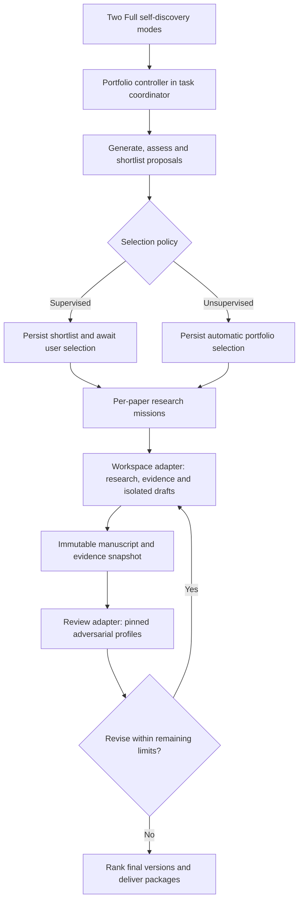

# Full self-discovery: proposed product and implementation plan

Status: proposal for discussion, September 9, 2026. This document does not describe
implemented features. Numerical defaults below are initial product choices to
calibrate through the evaluation program, not measured research success rates.

## 1. Recommendation

Add two named Automations:

- **Full self-discovery (supervised)**
- **Full self-discovery (unsupervised)**

Both use one durable research portfolio process. They differ in who selects the
projects and resolves ordinary research choices. Research standards, available
tools, review configuration, evidence requirements, and output formats are shared.

The default process is:

1. Interpret the research prompt and establish the available sources and methods.
2. Generate 75 distinct project proposals within the requested topics.
3. Adversarially screen every proposal; develop and review about 20 in depth.
4. Assemble a shortlist of 10 with a recommended selection of 5.
5. In supervised mode, wait for the user to select projects. In unsupervised mode,
   make and record that selection automatically.
6. Investigate each selected project, establish its main result, and write a paper.
7. Review each paper independently, revise within limits, and review the revision.
8. Rank the final papers and deliver their research materials.

The scientific objective is useful, defensible research. Paper count is a target;
it cannot justify fabricated results, unsupported claims, or empty manuscripts.
A useful refutation or negative result can become a paper. An unfinished proof
or unavailable dataset remains an explicit limitation or incomplete project.

## 2. Product contract and defaults

| Setting                       | Recommended initial value                                                    | Meaning                                                           |
| ----------------------------- | ---------------------------------------------------------------------------- | ----------------------------------------------------------------- |
| Candidate projects, C         | 75; configurable from 50 to 100                                              | Target number of distinct proposals before selection              |
| Deeply assessed candidates, M | min(C, max(20, 2N))                                                          | Additional development and two independent assessments            |
| Shortlist size, N             | 10; configurable from 1 to 25                                                | Number of project briefs presented or internally shortlisted      |
| Papers requested, K           | 5; configurable from 1 to 9                                                  | Must satisfy K <= N; preserves the requested K < 10               |
| Proposal review               | One screen for every candidate, two deeper reviews per finalist              | Separate contribution and feasibility perspectives                |
| Proposal revisions            | At most one revision per deeply assessed candidate                           | Review substantive changes before selecting                       |
| Research effort               | Up to eight investigation rounds per selected project                        | Each round must target a named uncertainty                        |
| Paper review                  | Two independent referees per review round                                    | General contribution and the relevant technical specialty         |
| Paper revisions               | At most two                                                                  | Initial review plus up to two revision/re-review cycles           |
| Research questions            | One selection checkpoint in supervised; none in unsupervised                 | Additional supervised checkpoints are optional                    |
| Replacement projects          | Off in supervised; up to two total in unsupervised                           | Unsupervised replacements come from the retained eligible reserve |
| Stagnation                    | Two rounds without substantive progress                                      | Stop or use an allowed fallback; do not repeat indefinitely       |
| Managed actions               | 500 across the entire automation                                             | New portfolio limit, including all descendants and retries        |
| Active execution time         | 48 hours in aggregate                                                        | Includes model and compute actions; excludes intentional waits    |
| Per-action timeout            | 30 minutes                                                                   | Tool-specific lower limits still apply                            |
| Elapsed deadline              | Seven days from Start                                                        | Includes selection waits, sleep, and account outages              |
| Deliverables                  | PDF, editable LaTeX, bibliography, research appendix and available code/data | Retain Markdown even if PDF compilation fails                     |

Validate 50 <= C <= 100, 1 <= K <= 9, K <= N <= 25, and N <= M <= C. Apply
the same target K to both modes. Counts describe intended work, not guaranteed
scientific yield. Show actual counts at each stage and explain any shortfall.

The simple launch surface needs a topic prompt, the two named modes, the paper
count, and a quality/effort preset. Existing sources, project instructions and
saved research settings are optional. Advanced settings expose the table above,
source policy, models, review profiles, ranking priorities and resource limits.
The initial quality preset is Standard; Light and Intensive change documented
counts and limits rather than substituting vague prompt adjectives.

Once credentials, research access and a usable execution environment have been
configured, unsupervised mode takes the prompt and starts within those saved
limits. It does not require a run-specific research questionnaire or a preview
approval after the user clicks Start. Missing environment prerequisites can be
reported before spending on research. Starting a run pins the effective settings.

### Supervised selection

The checkpoint presents N substantial briefs, not N titles or optimistic pitches.
Each brief includes the question, economic mechanism or identification argument,
closest related work, proposed contribution, first decisive test, data/tool
availability, expected effort, strongest objection, reply, and remaining doubt.

The interface recommends K projects, explains the portfolio, and lets the user
compare, select, exclude, edit a brief, or inspect all candidates. A substantive
edit creates a new brief revision and triggers its necessary reassessment.
Optional feedback can request a bounded replacement shortlist. There is no
automatic selection on timeout; deadline expiry retains the shortlist.

After selection, the system proceeds through research, drafting and review
without routine interruptions. If a selected project fails, the default is to
report that outcome. An explicitly chosen reserve list can authorize replacement.
Changing to a different economic question is not an ordinary revision.

### Unsupervised decisions

The system uses the same shortlist and research contracts, chooses K projects,
and retains its reasons. It resolves ordinary ambiguities through the prompt,
saved preferences and recorded assumptions. It cannot schedule a human research
question and call the run autonomous.

Unsupported methods, inaccessible data and exhausted project budgets trigger a
bounded fallback or abandonment. A fallback must remain within the prompt and
the available access; it cannot silently replace requested empirical evidence
with a simulation, or convert a requested theorem into a numerical illustration.
Unexpected permission or credential failures preserve artifacts and can produce
an environment-blocked terminal outcome. They do not create indefinite research
approval waits.

The normal final surface emphasizes papers and their ranking. The proposal
funnel, assumptions, review history and failed attempts remain inspectable and
exportable. No notification is needed for every intermediate model turn.

## 3. The research funnel

### A. Establish a research brief

Convert the prompt and selected immutable sources into a structured brief:

- Questions, topics, exclusions and intended audience.
- Admissible research types: theory, empirical, quantitative, synthesis, or a mix.
- Available data and source access, toolchains and compute limits.
- Desired contribution and standards of evidence.
- Ranking priorities and portfolio breadth.
- Assumptions inferred from missing information, with their consequences.

Do not invent a contribution or desired sign from a broad topic prompt. Distinguish
user requirements from model assumptions. A user asking for theory should receive
diverse theory projects, not a mandatory allocation to empirical work.

Build a shared literature map from the supplied collection and permitted
acquisition services. Record queries, dates, source versions and access coverage.
Source material is evidence to interpret, never an instruction that can change
the remit, selected tools, or ranking policy.

### B. Generate genuinely different proposals

Use several proposal passes with different economic lenses: relaxing assumptions,
connecting mechanisms, unexplained facts, measurement/identification, and policy
or welfare implications, as appropriate to the brief. Give early passes the same
brief and evidence without earlier proposals; later passes target coverage gaps.
These are scoped model roles; simultaneous execution is not required.

Generate bounded batches, for example 15 calls producing five proposals each.
Persist each proposal immediately. A proposal has a stable ID, a 200–400 word
argument, testable claims or propositions, a minimum feasible investigation,
required evidence, and a specific reason it might fail.

Deduplicate by the question, mechanism, method and claimed contribution, not
just title similarity. Store duplicate/derivative relationships and merge reasons.
Replenish under-covered areas up to a hard total of 100 generated proposal
attempts. If 75 distinct proposals cannot be obtained within that bound, show
the actual number; do not pad the portfolio with cosmetic variants.

### C. Screen all, investigate the strongest candidates more carefully

Every generated candidate receives a short adversarial screen, including those
later merged or rejected. Screens identify overlap with known work, incoherent
mechanisms, impossible identification, unavailable inputs, and poorly defined
claims. Batches may share retrieval work, but retain candidate-specific findings.

Advance M candidates using the brief's priorities and breadth requirements.
For each, build a fuller research design and run two independent assessments:

1. **Contribution referee:** strongest existing explanation, closest prior work,
   whether the claimed difference is substantive, and whether any possible outcome
   would change economic understanding.
2. **Methods referee:** feasibility of the proof, identification or computation;
   exact inputs needed; assumptions doing the work; and the cheapest decisive test.

Permit one response/revision. Material changes receive a further scoped assessment
within the same stage budget. A cheap pilot may establish data availability,
baseline solvability or feasibility; it does not license selection on a favorable
coefficient or statistically significant result. Record every pilot attempted.

Literature conclusions must name related sources and explain the difference.
"No matching search result" means no match was found in the recorded search,
not that novelty has been established. Abstract-only access cannot establish
claims about a paper's full argument or results.

### D. Select a portfolio

Separate eligibility from preference. Confirmed infeasibility, disallowed inputs
or an unresolved fatal design objection make a candidate ineligible. Novelty
uncertainty and scientific risk remain visible judgments rather than invented
probabilities. A promising conjecture is eligible for investigation; it is not
already a proven theorem.

Reviewers assess contribution, feasibility, evidence access, and information
value with short anchored ordinal judgments and supporting reasons. Selectors
see disagreement as well as the consensus. Do not hide a fatal objection inside
an average numerical score.

Choose N briefs and recommend K as a portfolio: strong individual projects with
limited redundancy and different failure modes. The default includes at most
two projects from a close mechanism/contribution cluster when alternatives of
comparable quality exist. Treat this as a soft constraint under a narrow prompt.
Include a credible ambitious project when it clears the feasibility floor; do
not force a speculative allocation simply to fill a category.

Record a stable ordering, the selection rationale and a reserve ordering. If
fewer than N candidates clear the eligibility floor, report fewer. Supervised
mode allows a smaller selection or another bounded search; unsupervised mode
uses the available eligible set and records any shortfall against K.

## 4. Developing each selected project

### Research contract before manuscript

Each selected project gets an isolated task working copy, its own research
records and role conversations, and a fixed share of the parent budget. The
user's Project is the durable container; candidate proposals do not create 75
Project folders. Separate papers have separate editable roots. An output can
later be continued or exported into a separate Project.

Create a versioned research contract containing:

- Central question, proposed contribution, and alternatives to distinguish.
- Core assumptions, proof obligations or identification conditions.
- Main outcome/estimand and the baseline specification, when applicable.
- Minimum result that would support a paper, including valuable negative results.
- Decisive failure conditions and allowed within-question pivots.
- Exact sources, datasets, sample rules, execution capabilities and budget.

The contract commits to a question and method, not a preferred answer. Revisions
retain their timing and rationale. A post-result design change cannot be relabeled
as a prospective plan.

### Investigate, challenge, decide

Use the existing plan → investigate → challenge structure as the inner loop.
Each investigation identifies what uncertainty it addresses, possible outcomes,
and how the outcome changes the next action. Prefer inexpensive discriminating
tests before expensive extensions. End a round by continuing, revising a method,
accepting a bounded negative finding, or abandoning the project.

| Research type           | Main-result work before a full draft                                                                                                | Evidence needed in the paper package                                                                            |
| ----------------------- | ----------------------------------------------------------------------------------------------------------------------------------- | --------------------------------------------------------------------------------------------------------------- |
| Theory                  | Precise propositions, derivations, boundary cases and attempted counterexamples                                                     | Assumptions, proof steps, unresolved obligations, exact computational checks where used                         |
| Empirical               | Data/schema validation, executed sample construction, baseline reproduction, identification checks and a declared robustness family | Dataset versions, sample/specification identities, code, all attempts, estimates and uncertainty from execution |
| Quantitative macro      | Baseline solution, equilibrium/residual checks, parameter sources, sensitivity and counterfactual validation                        | Calibration/estimation inputs, solver diagnostics, convergence evidence and exact counterfactual outputs        |
| Literature or synthesis | Verified source coverage, competing accounts and an explicit synthesis argument                                                     | Source-to-claim references and access limitations; no claim to a new empirical result                           |

Model-written proof is an argument requiring assessment. Numerical checks establish
the tested cases or provide counterexamples; they do not prove general results.
Simulation output is not observed economic data. Unexecuted code is not a result.

Retain all empirical specifications, failures and exclusions. Where adaptive
search affects inference, use an appropriate declared validation strategy such
as untouched validation data or explicit exploratory status. Merely logging
search does not correct selection bias. Do not rank projects on favorable signs
or significance, and do not spend robustness budgets searching for those outcomes.

### Write from a results dossier

An outline can start early. Full claims-bearing prose follows a versioned dossier
of what was established, refuted or left uncertain. Link central claims, numbers,
tables, figures and citations to their actual evidence. Distinguish a missing
evidence link from evidence that was checked and found inadequate.

Produce a coherent working paper with an abstract, motivation, related work,
model/design, results, limitations and appendices appropriate to its type.
Preserve academic writing preferences without enforcing one structure on all
disciplines. Mathematical notation, welfare objects, units and assumptions must
remain consistent across prose, equations and results.

Use existing publication assets and deliverable assembly where applicable.
Add a standalone LaTeX project template and a qualified compilation/rendering
step: the existing TeX fragments alone are not a complete paper exporter.

## 5. Adversarial review and revision

Provide separate configurable review policies for proposals, research milestones
and manuscripts. Offer built-in contribution, theory, empirical identification,
quantitative methods, replication, and exposition roles. Users can choose
reviewer count, available models, profiles, rounds, severity thresholds and
revision effort. Pin the resolved configuration at launch.

The paper loop is explicit:

`draft v1 → independent reviews → revision v2 → independent re-review → … → final reviewed version`

For every review round:

1. Capture the exact manuscript, supporting code, relevant data references,
   execution receipts and rendered exhibits as an immutable review package.
2. Run two referees in fresh review contexts. They do not receive the author's
   conversation, proposal ranking, earlier self-evaluation or each other's initial
   reports. Role separation reduces shared bias; it does not guarantee independence.
3. Require findings to identify the affected claim, supporting evidence, severity,
   required resolution and the conditions under which the concern would be resolved.
4. Have an editor reconcile the reports. Conflicting material claims trigger a
   targeted check or an explicit unresolved disagreement, not a majority vote.
5. Revise the manuscript and any affected research outputs. Produce a response
   ledger connecting each finding to changes, new evidence or a reasoned rebuttal.
6. Recheck affected claims and review the changed package. A broad change requires
   broad re-review; a successful compilation alone does not close substantive issues.

The final delivered version must be the version used for its attached review and
ranking. Never make a last unreviewed substantive revision. If the last edit has
not been assessed, retain it as an additional draft and deliver the earlier
reviewed version as the reviewed result.

Stop when required findings are resolved with evidence, the configured limit is
reached, or two rounds add no substantive progress. A referee's failure to object
is a model assessment, not researcher acceptance or verification of truth.

Allow adversarial stages to be reduced or disabled in advanced settings. With
zero paper reviews, deliver the draft labeled **Not adversarially reviewed**;
final ranking is not a substitute for that review. Schema validation, provenance,
artifact integrity and honest claim labels remain ordinary product invariants.

## 6. Final ranking and delivery

Proposal ranking predicts the value of an investigation. Final ranking evaluates
the actual paper. Keep them separate so that an appealing proposal cannot carry
a weak manuscript to the top of the results.

Rank papers only after their final versions are frozen. An independent assessor
first reads anonymized paper packages in a recorded shuffled order, without
proposal ranks or author identities. It then sees the review/response ledger and
confirms or changes its assessment. At K <= 9, all pairwise comparisons are
manageable (10 pairs at the default K = 5); use these for close cases, with
persisted input order and a deterministic tie rule.

Present substantive soundness/evidence status before the ordinal ranking. A
paper with an unresolved fatal objection cannot outrank an eligible paper by
having better prose. Within an eligible group, assess economic contribution,
strength of support, originality relative to inspected literature, completeness,
and clarity. Show ties or low-confidence orderings when reviewers disagree.
There is no "top-five publication probability" or spurious decimal quality score.

Results show the requested K and actual delivery count, then for each paper:

- Rank or tie group, title, abstract, central result and a concise ranking reason.
- Evidence status, review coverage and unresolved material objections.
- Open PDF, edit manuscript, inspect reviews, and continue research actions.
- A package containing editable source, bibliography, results/figures, appendices,
  review responses, claims/evidence links, and permitted replication materials.

Distinguish complete paper drafts, incomplete research drafts and abandoned
projects. If only three of five investigations support full papers, deliver three
papers and the retained material for the other two. Do not present five successful
papers by filling the gap with invented findings. If none succeeds, return the
research record and a clear zero-paper outcome.

The portfolio report explains selection, exclusions, replacements, rank changes,
budget use and unresolved questions. The default unsupervised view can collapse
this material, but the evidence stays accessible. Missing credentials, omitted
licensed data, unavailable compilation and partial replication are explicit
package properties. Exports contain no credentials or execution grants.

## 7. Architecture: extend the existing owners

The current architecture has three relevant owners: Workspace for interactive
research and scientific objects, Reviews for immutable structured assessments,
and the durable task coordinator for scheduling and cross-mode orchestration.
These modes should remain intact. See [CLAUDE.md](../CLAUDE.md),
[Automations](tasks.md), and [Research missions](research-missions.md).

Implement a typed portfolio controller under `orchestration/discovery/`, using
the existing coordinator's dispatcher, journal, recovery and adapter boundaries.
Use existing missions for individual adaptive investigations and pinned Review
profiles for assessments. A controller makes durable decisions; it does not own
another provider runtime or scheduling service.

Do not implement the whole feature as one long model prompt, one oversized
Workflow graph, or a collection of unrelated mission runs. A Workflow remains
useful for an individual review. The portfolio needs durable candidate identities,
selection, adaptive research and parent-wide limits that span those child actions.

### Ownership and records

| Proposed object                | Authoritative owner                            | Required contents                                                                                                |
| ------------------------------ | ---------------------------------------------- | ---------------------------------------------------------------------------------------------------------------- |
| `DiscoveryDefinition`          | Coordinator                                    | Versioned prompt/brief references, supervision policy, counts, stage policies, source/tool scope and budgets     |
| `DiscoveryRun`                 | Coordinator                                    | Phase, lifecycle status, pinned definition, child ownership, selection identity and cumulative reservations      |
| `CandidateProject`             | Coordinator                                    | Stable ID, immutable brief revisions, duplicates, assessment references, disposition and source links            |
| `SelectionDecision`            | Coordinator                                    | Exact shortlist revision, selected IDs/revisions, selector, reasons, reserve choices and idempotency key         |
| `PaperTrack`                   | Coordinator                                    | Selected candidate revision, child mission IDs, progress, replacement lineage and budget allocation              |
| `ResearchContract` and dossier | Workspace                                      | Exact research objects, hypotheses/assumptions, evidence classes, source/result references and dossier revisions |
| Manuscript/review package      | Workspace and Review, through immutable copies | Content hashes, supporting artifacts, findings and response revisions                                            |
| `FinalAssessment`              | Coordinator                                    | Exact delivered package identity, eligibility, criteria, comparisons, ties and uncertainty                       |

Candidate proposals are planning records, not new accepted research facts. Use
existing exact Workspace references for scientific evidence. Each owner's store
remains authoritative; cross-owner exchanges carry immutable data and receipts.

Keep definitions and small summaries in the coordinator, with paginated candidate
and assessment tables and bounded artifact references. Do not embed 100 proposals,
five manuscripts and every review inside the existing mission JSON response or
one task's retained context. Prompts load only the relevant brief, evidence and
findings; durable state does not depend on a conversation summary remaining intact.

### Phases and lifecycle

Persist phase separately from lifecycle status. Suggested phases are `brief`,
`generate`, `screen`, `assess`, `shortlist`, `select`, `research`, `write`,
`review`, `rank`, and `deliver`. Paper tracks have their own phases so that one
failed project does not stop the rest of the portfolio.

Suggested lifecycle statuses are `prepared`, `running`, `awaitingSelection`,
`paused`, `stopping`, `completed`, `partial`, `exhausted`, `blocked`, `failed`,
and `cancelled`. `awaitingSelection` is legal only for supervised runs. Success
of the orchestration and assessment of the science are separate fields.

Selection binds exact IDs and revisions in one transaction and is consumed once.
An edited or regenerated shortlist invalidates stale selection submissions.
Automated selection produces the same record shape. Paper forks, replacements
and changed configurations get explicit lineage; old assessments remain readable.

Pause stops new admissions and lets active actions settle. Stop cancels only
owned descendants and retains their receipts. Restart reconciles submitted work
before advancing. Ambiguous model or process acknowledgements are never blindly
replayed. Deadline expiry during selection preserves the shortlist without making
a choice; expiry during research packages available work as partial or exhausted.

### Important existing limitations

The current [mission types](../gui/src-tauri/src/orchestration/missions/model.rs)
and [validation](../gui/src-tauri/src/orchestration/missions/validate.rs) allow
eight candidates per investigation plan, 64 goals, and at most 256 actions per
mission. The portfolio is a different planning level. Do not increase those
inner-loop bounds simply to fit 100 project proposals into one mission.

The existing mission adapter prepares planner/investigator/challenger roles from
one source scope. Clean author/referee context and independent per-paper roots
need explicit adapter support; separate conversation IDs alone are insufficient.
The task model's current single mission association also needs a durable parent
portfolio relationship so child ownership and cumulative budgets cannot be lost.

Workspace currently permits one native turn globally, and Reviews permits one
run globally. The first release must schedule fairly within these limits.
Logical independent paper tracks are useful for recovery and allocation even
when their native turns execute serially. Real concurrent Workspace turns require
separate [protocol](workbench/protocol/compatibility-policy.md) and lifecycle
qualification; a UI concurrency slider cannot enable them safely.

### The capability gap that matters most

Current missions can choose existing checks and finite captured experiment
variants. New arbitrary scripts are not authorized by mission prose. Captured
execution currently reports `host_access` and `declared_only`; copied input
folders are not a computer sandbox. Acquisition is also a separate Workspace
service, not general model web search. These are documented in the
[research desk](workbench/research-desk.md) and
[research programs](workbench/research-programs.md).

For the full product, add a Workspace-owned autonomous execution capability:

- An isolated, provisioned execution environment with pinned toolchain identity,
  explicit read-only input mounts, a per-paper output root and resource limits.
- Fresh code may be written and executed inside that environment under the
  user's saved research grant. The policy constrains authority; model-written
  code review does not grant access or certify containment.
- Default compute networking is off. A separate acquisition broker retrieves
  sources/data within authorized endpoints, sizes and data-sharing policy, and
  hands immutable captures to research. Model requests cannot export arbitrary
  project data as a search query or acquire new credentials.
- Generated programs cannot edit the controller, permissions, budget records,
  reference results or other papers. Imports and captured plans are inert until
  admitted under the local environment policy; restored artifacts carry no grants.
- Each run retains code, parameters, seed, environment identity, logs, exact
  outputs and the validated result envelope. New attempts spend parent budget.

This is a distinct execution capability, not a weakening of existing exact-plan
host grants. Qualified environments should be advertised explicitly. On this
Mac, every host Stata action must continue through `oldstata`; a general portable
Stata worker is separate work. Do not promise unrestricted economics toolchains
in the first isolated worker.

Also add model-accessible, bounded acquisition requests through Workspace's
owning service. Existing metadata queries, explicit PDF import and source reads
are useful foundations, but unattended literature discovery needs an explicit
service contract and provenance for selection/import. Broad empirical research
will additionally need dataset discovery, acquisition and schema validation for
each supported source; unavailable data cannot be solved by a stronger prompt.

## 8. Budgets and configuration

Reserve limits atomically before child dispatch. Every child and nested review
belongs to one portfolio. Creating another mission, restarting a process or
replacing a failed project does not reset allowances. Reconcile usage exactly
once through receipts, including failed and rejected responses.

As an initial allocation, reserve 25% for discovery and selection, 50% for
research/drafting, 20% for review/revision, and 5% for ranking/packaging. Allocate
an equal initial research share to selected projects; reassign unspent capacity
based on explicit progress and unmet checks. Preserve the final assessment and
delivery reserve. Percentages are spending ceilings/reservations, not promises
that a stage will succeed within them.

Track managed actions, active execution, elapsed deadline, compute, storage and
provider-reported usage separately. A managed action can contain multiple native
model calls or Review steps, so its count is not a token or dollar cap. Show a
preparation estimate from the actual selected profiles and stage multiplicities;
report usage as unknown where a provider does not expose it. Never show unknown
cost as zero or claim a hard financial cap without enforceable provider limits.
If a user requires such a cap, admit only compatible backends or decline that
configuration before launch. Account limits suspend within the deadline; they
do not authorize a provider switch or a paid purchase.

Advanced review settings are versioned stage policies, not a new arbitrary
Workflow editor. A proposal-review policy and a manuscript-review policy may
reference saved immutable profiles. Expose iterations as "revision passes" and
"maximum reviews" with their exact relationship: two revision passes entail up
to three assessments of distinct manuscript versions. Bound malformed-response
repairs and transport retries as well as scientific iteration.

Allow different available models by role where the owning adapter supports them.
Cross-provider manuscript Reviews already have a natural owner; cross-provider
Workspace authors are a separate capability. A saved request for an unavailable
model must not silently become another model. Record actual model/profile and
prompt version with each assessment.

## 9. Interface

Place the two exact names in **Project → Automate → New automation**, alongside
the existing research automation entry. A Home shortcut can create/select a
Project and open the same form. Do not add a new primary navigation section.

The creation surface uses prompt-first copy. Show the expected funnel in plain
language, for example: "Explore 75 projects, show me 10, and develop my 5
selections into papers." Unsupervised copy: "Explore 75 projects, choose 5, and
return the papers." Advanced settings can be collapsed into counts, research
access, reviews, and limits.

During a run, show the current stage, actual candidate/paper counts, budget use
and meaningful findings. The paper board distinguishes investigating, drafting,
reviewing, complete and incomplete. Progress is based on completed stages and
known work; do not claim a precise scientific completion percentage.

The supervised comparison view shows concise briefs side by side, expandable
referee reports, recommended choices and selection count. Keyboard selection,
clear focus, saved selections and stale-revision handling are required. A compact
history explains why a candidate disappeared after revision or deduplication.

Results lead with the papers and the evidence behind their ranking. Review
settings and usage history stay available without dominating the reading view.
The local runtime requires Pipeline's native process to be running and the
computer awake; close-to-tray is not an always-on service. Remote/always-on
execution is a subsequent deployment capability.

## 10. Implementation sequence and completion criteria

| Milestone                                | Concrete work                                                                                                                                  | Completion criterion                                                                                                                     |
| ---------------------------------------- | ---------------------------------------------------------------------------------------------------------------------------------------------- | ---------------------------------------------------------------------------------------------------------------------------------------- |
| SD-0: contracts                          | Versioned definitions, candidate/selection/paper records, validators, stage policies, fixtures and evaluator rubric                            | All cardinality, lineage and evidence-status rules are executable; new records do not alter current missions                             |
| SD-1: durable proposal funnel            | Coordinator extension, per-candidate persistence, generation/deduplication/screens, shortlist, both selectors, scoped UI                       | Real 50/75/100-candidate runs survive restart and reach the correct selection behavior; frozen proposal exports are inspectable          |
| SD-2: full paper path on bounded inputs  | Per-paper roots and mission ownership, research contracts, results dossiers, drafting, immutable Reviews, revision, ranking, TeX/PDF packaging | Both modes complete from prompt to packages using supplied/approved inputs; every ranked version matches its review                      |
| SD-3: autonomous capabilities            | Isolated generated-code execution, bounded acquisition tools, supported dataset adapters, parent accounting and failure handling               | A fresh prompt produces executed research without per-script approval inside the saved scope; denial/escape and provenance fixtures pass |
| SD-4: research and release qualification | Authenticated economics pilots, blind assessment, restart/timeout/cancel tests and native development UI validation                            | Evidence establishes each advertised research type and platform; unresolved limitations remain visible                                   |

SD-0–SD-2 should provide a narrow internal vertical slice, not be marketed as
unrestricted autonomous empirical research. Prioritize a theory question and a
small fully supplied empirical question for early end-to-end work. Begin the
execution capability design early, since SD-3 is on the critical path to the
prompt-only empirical/quantitative promise. Qualify both supervised and
unsupervised paths together rather than bolting autonomy onto a manual workflow.

Proposed new owners are `orchestration/discovery/` for controller/model/store/
selection/ranking, a focused Workspace discovery adapter for roots and scientific
objects, and lazy `components/self-discovery/` surfaces with an app-owned typed
client. Extend existing mission, Review, execution and publication-asset owners
through narrow adapters. Add the next migrations at implementation time; do not
reserve a stale schema number or modify applied migrations.

### Engineering checks

- Validate malformed/oversized responses, duplicate IDs, candidate count edges,
  stale selection, K >= 10, shortlist shortage and duplicate attempt bounds.
- Kill/restart at candidate persistence, child admission, model submission,
  execution, review adoption and final delivery. No repeated paid work after an
  unknown acknowledgement; no duplicate selection or unowned child.
- Test aggregate budget reservations under competing children, replacement
  attempts, malformed-response repairs, exhaustion and simultaneous cancellation.
- Verify no supervised timeout auto-selects and no unsupervised research input
  waits are created. Exercise inaccessible data and insufficient eligible papers.
- Attempt cross-paper writes, out-of-scope reads/network calls and budget edits in
  the actual execution environment. Prompt instructions are not containment tests.
- Mutate a script, dataset, manuscript or review profile and confirm that older
  evidence/reviews cannot qualify the changed artifact silently.
- Check final reviewed hashes, broken citations, mismatched numbers, missing
  figures, failed compilation, partial packages and archive grant retirement.
- Run the repository's focused and full release gates when implementing each
  milestone. Native GUI checks use Tauri development mode with disposable stores.

### Scientific evaluation

Create 12 fixed economics briefs: three each in theory, empirical work,
quantitative macro, and literature/synthesis. Include known counterexamples,
an infeasible dataset, a duplicate contribution under different terminology, a
null result, sensitivity to an assumption, and a tempting invalid identification
argument. Keep evaluator reference answers unavailable to the research roles.

First test narrow fixtures, then compare the complete process against direct
paper drafting and the current single research automation under matched model,
evidence and spending limits. Run ablations for proposal breadth, adversarial
review and revision; repeat stochastic runs instead of selecting a showcase.
For supervised evaluation, record human selection effort separately.

Independent economists should assess the final papers without knowing the
generation method. Measure material error rates, citation entailment, executed
result reproduction, distinctness of contributions, usefulness of the strongest
paper, usefulness of the portfolio, referee detection of seeded flaws, and
agreement about ranking. Record cost, wall time, human interventions, failed
projects and incomplete runs. Fluency and manuscript count are secondary.

Require all deterministic provenance/lifecycle fixtures to pass and every claim
of reproduced numeric output to have a successful exact execution comparison.
Materially unsupported claims must be surfaced in the output classification.
Pilot evidence must support a benefit in usefulness or material-error reduction
over the matched baseline before a broad quality claim. Report sample sizes,
uncertainty and negative findings; no fixed automated score certifies scientific
correctness. Set domain-specific launch thresholds prospectively with the
evaluators. Follow the existing
[release qualification policy](workbench/release-qualification.md).

## 11. Research-system lessons informing this proposal

The AI Scientist-v2 provides a relevant end-to-end example of ideation, experiment
search and manuscript generation. Its own documentation cautions that broader
exploration can have lower success rates than a strong template. That supports
retaining domain-specific research contracts and a staged funnel while allowing
adaptive investigations. It does not establish effectiveness in economics.
Source: [SakanaAI's implementation and documentation](https://github.com/SakanaAI/AI-Scientist-v2).

An independent evaluation of the earlier AI Scientist reported novelty
misclassification, experimental implementation failures and missed serious flaws
in model reviews. These findings motivate explicit literature comparisons,
executable evidence checks, and an evaluator separate from the author/reviser.
They concern that evaluated system and setup, not a measured failure rate for
Pipeline or all autonomous research systems. Source:
[Beel, Kan and coauthors' evaluation](https://www.comp.nus.edu.sg/~kanmy/papers/2502.14297v2.pdf).

## 12. Decisions recommended now

Adopt the two exact names and one shared portfolio controller. Make project
selection the sole default supervised checkpoint. Start with the 75 → 20 → 10 → 5
funnel, configurable reviews and two revision passes. Make research contracts,
evidence-linked drafting and final-version review identity part of the core
design. Treat automatic replacement as an explicit bounded policy and partial
delivery as a normal, honest outcome.

Treat acquisition and isolated execution as product capabilities with their own
owners and qualification, rather than assuming current captured checks already
provide unrestricted autonomy. Defer concurrent native turns, an always-on
service and autonomous remote compute provisioning until the sequential local
product has demonstrated useful research.
